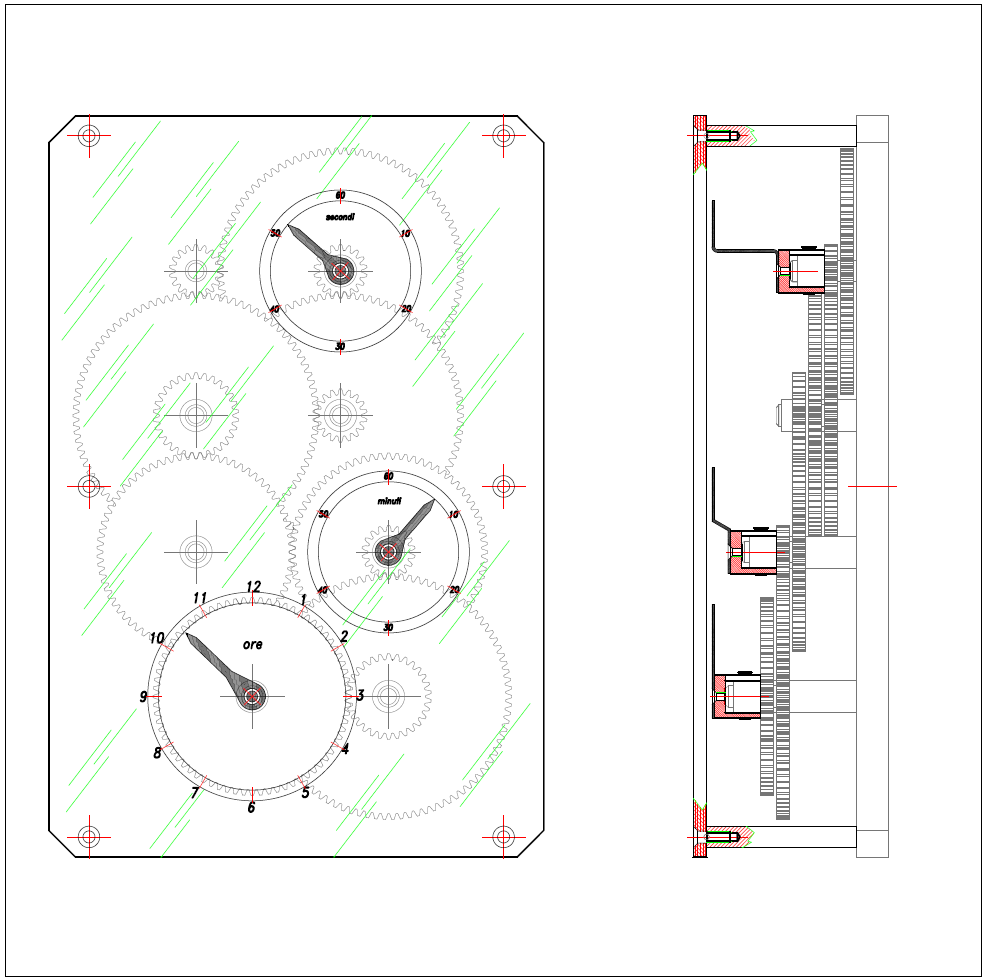
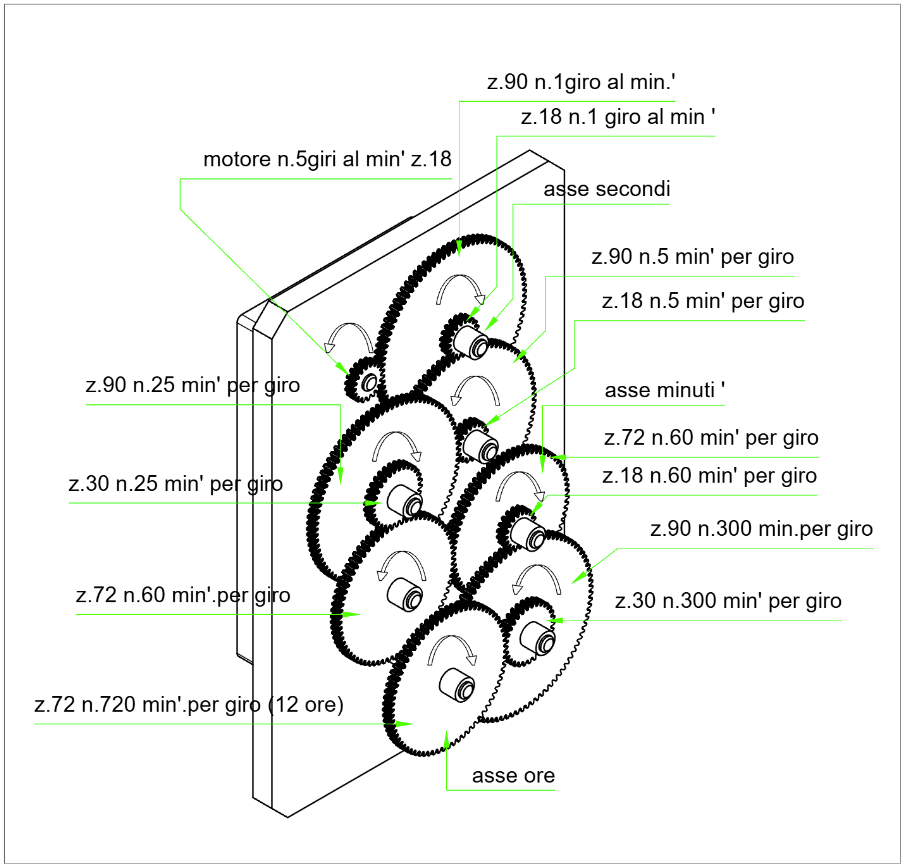

Questo progetto utilizza un **ESP8266** per pilotare un motore passo-passo con estrema precisione temporale, eliminando le interferenze tipiche delle funzioni bloccanti o dello stack Wi-Fi.

---

## 📝 Descrizione del Progetto
L'obiettivo è generare un segnale di STEP ogni **60 ms** esatti. Per raggiungere una precisione di livello cronometrico, il codice bypassa le funzioni standard di Arduino (come `delay()` o `digita[...]

Il motore passo-passo è collegato ad un pignone che comanda una cascata di ingranaggi, di cui tre di questi sono collegati a ore, minuti e secondi.

[Schema completo in formato DWG](docs/completo.dxf.dwg)

---

## 🔌 Schema di Collegamento

### Tabella dei Pin
| Componente | Pin ESP8266 | Pin Driver (A4988/DRV8825) | Funzione |
| :--- | :--- | :--- | :--- |
| **Alimentatore 12V** | - | **VMOT / GND** | Potenza Motore |
| **Alimentatore 5V** | **VIN** | **VDD** | Logica |
| **Massa Comune** | **GND** | **GND** | Riferimento 0V |
| **Segnale Step** | **GPIO 5 (D1)** | **STEP** | Impulso movimento |
| **Segnale Dir** | **GPIO 4 (D2)** | **DIR** | Direzione rotazione |

> **Nota:** Ricorda di inserire un condensatore elettrolitico (100µF) tra i pin VMOT e GND del driver per assorbire i picchi di corrente.

## 💻 Descrizione del Codice

### 1. Ottimizzazione del Sistema
Nel `setup()`, il Wi-Fi viene spento con `wifi_set_opmode(NULL_MODE)`. Questo è fondamentale: lo stack Wi-Fi dell'ESP8266 "ruba" cicli di CPU ogni pochi millisecondi, causando ritardi imprevedibi[...]

### 2. Il Timer e l'Interrupt
Il cuore è la funzione `onTimer()`, marcata con `ICACHE_RAM_ATTR` per essere eseguita direttamente dalla RAM (più veloce).
* **Calcolo Ticks:** Con un prescaler di 16 su una CPU a 80MHz, `300.000` ticks corrispondono esattamente a **60.000 µs** (60 ms).
* **ASM Nop:** Il brevissimo impulso di 3 microsecondi è generato con un ciclo `nop` (No Operation) in Assembly, garantendo che il driver riconosca lo scalino di tensione.

### 3. Loop Principale
Il `loop()` rimane vuoto, contenendo solo un `yield()` per permettere al sistema (Watchdog Timer) di respirare senza resettare la scheda, lasciando tutto il lavoro critico al Timer hardware.

---

## 🛠️ Requisiti Hardware
* Microcontrollore ESP8266 (NodeMCU o Wemos D1 Mini).
* Driver Stepper DRV8825.
* Motore Passo-Passo (NEMA 17 o simili).
* Alimentatore DC adeguato alla coppia del motore.

## 🎬 Multimedia
* [📥 Scarica Video 1 (Tasto destro -> Salva link con nome)](docs/video1.mp4)
* [📥 Scarica Video 2 (Tasto destro -> Salva link con nome)](docs/video2.mp4)

## 👥 Autori

- Samuele Gerbaldo *(project leader)*
- Marwan El Kazzari
- Jacopo Scotto
- Mattia Canepa

## 🤝 Supporto esterno

- Corrado Gerbaldo *(coding)*
- Giorgio Gerbaldo *(3D Modeling Specialist)*
