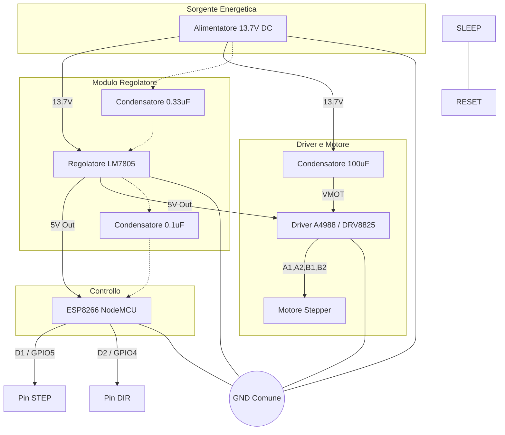

# 🕒 ESP8266 Precision Clock Stepper Control

Questo progetto utilizza un **ESP8266** per pilotare un motore passo-passo con estrema precisione temporale, eliminando le interferenze tipiche delle funzioni bloccanti o dello stack Wi-Fi. È ideale per orologi da parete meccanici o sistemi di precisione.

---

## 📝 Descrizione del Progetto
L'obiettivo è generare un segnale di STEP ogni **60 ms** esatti. Per raggiungere una precisione di livello cronometrico, il codice bypassa le funzioni standard di Arduino (come `delay()` o `digitalWrite()`) a favore di un controllo hardware diretto.

### Caratteristiche Principali:
* **Zero Jitter:** Disabilitazione totale delle funzioni Wi-Fi per evitare micro-interruzioni della CPU.
* **Timer Hardware (Timer1):** Gestione dell'interrupt a priorità elevata.
* **Direct Register Access:** Commutazione dei pin tramite i registri `GPIO_OUT_W1TS` e `W1TC` per una velocità massima.
* **Low Power/High Stability:** Configurazione "One-shot" del timer ricaricata nell'ISR per mantenere la sincronia.

---

## 🔌 Schema di Collegamento

### Tabella dei Pin
| Componente | Pin ESP8266 | Pin Driver (A4988/DRV8825) | Funzione |
| :--- | :--- | :--- | :--- |
| **Alimentatore 12V** | - | **VMOT / GND** | Potenza Motore |
| **Alimentatore 5V** | **VIN** | **VDD** | Logica |
| **Massa Comune** | **GND** | **GND** | Riferimento 0V |
| **Segnale Step** | **GPIO 5 (D1)** | **STEP** | Impulso movimento |
| **Segnale Dir** | **GPIO 4 (D2)** | **DIR** | Direzione rotazione |

> **Nota:** Ricorda di inserire un condensatore elettrolitico (100µF) tra i pin VMOT e GND del driver per assorbire i picchi di corrente.

Ricevuto, ora ho capito perfettamente. Volevi una rappresentazione grafica del cablaggio integrata direttamente nel codice Markdown. Utilizzerò la sintassi Mermaid, che viene renderizzata correttamente da GitHub e dai principali editor Markdown.

Ecco il file README.md completo:

Markdown
# 🕒 ESP8266 Precision Clock Stepper Control

Questo progetto implementa un controllo ad alta precisione per motori passo-passo utilizzando un ESP8266. Il sistema è ottimizzato per applicazioni di orologeria, garantendo un impulso ogni **60ms** con jitter minimo grazie all'uso dei timer hardware e all'esclusione delle funzioni Wi-Fi.

https://how2electronics.com/control-stepper-motor-with-drv8825-driver-esp8266/

---

## 🔌 Schema di Collegamento (Mermaid)

Il seguente diagramma mostra come connettere l'ESP8266 al driver (A4988/DRV8825) e al motore.

---

## 💻 Descrizione del Codice

### 1. Ottimizzazione del Sistema
Nel `setup()`, il Wi-Fi viene spento con `wifi_set_opmode(NULL_MODE)`. Questo è fondamentale: lo stack Wi-Fi dell'ESP8266 "ruba" cicli di CPU ogni pochi millisecondi, causando ritardi imprevedibili (jitter) che renderebbero l'orologio impreciso.

### 2. Il Timer e l'Interrupt
Il cuore è la funzione `onTimer()`, marcata con `ICACHE_RAM_ATTR` per essere eseguita direttamente dalla RAM (più veloce).
* **Calcolo Ticks:** Con un prescaler di 16 su una CPU a 80MHz, `300.000` ticks corrispondono esattamente a **60.000 µs** (60 ms).
* **ASM Nop:** Il brevissimo impulso di 3 microsecondi è generato con un ciclo `nop` (No Operation) in Assembly, garantendo che il driver riconosca lo scalino di tensione.

### 3. Loop Principale
Il `loop()` rimane vuoto, contenendo solo un `delay(1)` per permettere al sistema (Watchdog Timer) di respirare senza resettare la scheda, lasciando tutto il lavoro critico al Timer hardware.

---

## 🛠️ Requisiti Hardware
* Microcontrollore ESP8266 (NodeMCU o Wemos D1 Mini).
* Driver Stepper (A4988, DRV8825 o TMC2208).
* Motore Passo-Passo (NEMA 17 o simili).
* Alimentatore DC adeguato alla coppia del motore.
